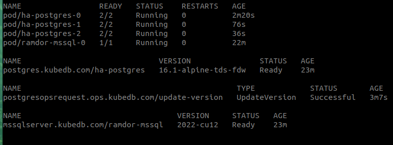
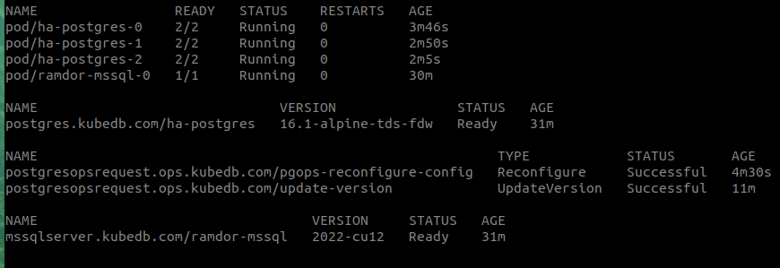
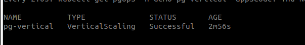

# pg-sqlserver-demo

## Apply the versions (catalog)
```bash
kubectl apply -f versions/
```
## Create issuer secret and issuer
```bash
    $ cd dbs 

    $ ./create-ca.sh
    # it will create a ca.crt and ca.key file
    # you will need to provide the path of this two file in the below secret

    $ cat create-issuer-secret.sh 
    #! /usr/bin/bash
    kubectl create secret tls issuer-ca --cert=ca.crt  --key=ca.key --namespace=demo
    # -----

    # create a issuer secret that we will be used to issue certificate
    $ ./create-issuer-secret.sh
    secret/issuer-ca created

    # create a issuer for issuing certificate in our cluster
    $ kubectl apply -f issuer.yaml 
    issuer.cert-manager.io/db-issuer created
```

## Create databases

```bash
    $ kubectl apply -f mssql-standalone.yaml 
    mssqlserver.kubedb.com/ramdor-mssql created

    $ kubectl apply -f ha-postgres.yaml 
    postgres.kubedb.com/ha-postgres created

    # Wait until both db is ready
```
## Get the password of db's

```yaml
kubectl get secret -n demo ramdor-mssql-auth -oyaml
apiVersion: v1
data:
  password: ODduSnZYSFhIU1U2elBlYg==
  username: c2E=
kind: Secret
metadata:
  creationTimestamp: "2024-11-28T06:49:35Z"
  labels:
    app.kubernetes.io/component: database
    app.kubernetes.io/instance: ramdor-mssql
    app.kubernetes.io/managed-by: kubedb.com
    app.kubernetes.io/name: mssqlservers.kubedb.com
  name: ramdor-mssql-auth
  namespace: demo
  ownerReferences:
  - apiVersion: kubedb.com/v1alpha2
    blockOwnerDeletion: true
    controller: true
    kind: MSSQLServer
    name: ramdor-mssql
    uid: 770f8f0f-eb94-4963-a852-1420e69f48c5
  resourceVersion: "95339"
  uid: 3e4599a4-fa88-4c62-adaf-0d7ccb061fc9
type: kubernetes.io/basic-auth
```

```bash
    $ echo "ODduSnZYSFhIU1U2elBlYg==" | base64 -d
    87nJvXHXHSU6zPeb
```
We will use this password in next step

### Setup tds-fdw

Setup in `MSSQLSERVER`, This part is given in `setup.sql`

```bash
$ kubectl exec -it -n demo ramdor-mssql-0 -- bash

Defaulted container "mssql" out of: mssql, mssql-init (init)

mssql@ramdor-mssql-0:/$ /opt/mssql-tools/bin/sqlcmd -S localhost -U sa -P "87nJvXHXHSU6zPeb"

1> CREATE DATABASE Sales
2> go
1> USE [SALES]
2> GO
Changed database context to 'Sales'.
1> CREATE TABLE TDS([id] [int] NOT NULL, [data] varchar(255) NOT NULL)
2> GO
1> INSERT INTO TDS (id, data) VALUES (1,'cat'),(2,'dog'),(3,'horse')
2> GO

(3 rows affected)
1> SELECT * from [Sales].[dbo].[TDS]
2> GO
id          data                                                                                                                                                                                                                                                           
----------- 
          1 cat                                                                                                                                                                                                                                                            
          2 dog                                                                                                                                                                                                                                                            
          3 horse                                                                                                                                                                                                                                                          

(3 rows affected)
1> 

```

Setup in `Postgres`, This part is given in `setup.sql`

```bash
$ kubectl exec -it -n demo ha-postgres-0  -- bash

Defaulted container "postgres" out of: postgres, pg-coordinator, postgres-init-container (init)

ha-postgres-0:/$ psql

psql (15.5)
Type "help" for help.

postgres=# CREATE DATABASE ramdor;
CREATE DATABASE

postgres=# \c ramdor
You are now connected to database "ramdor" as user "postgres".

ramdor=# CREATE EXTENSION tds_fdw;
CREATE EXTENSION

ramdor=# SELECT oid, extname, extversion FROM pg_extension;
  oid  | extname | extversion 
-------+---------+------------
 13604 | plpgsql | 1.0
 16395 | tds_fdw | 2.0.4
(2 rows)


ramdor=# CREATE SERVER mssql_svr FOREIGN DATA WRAPPER tds_fdw OPTIONS (servername 'ramdor-mssql.demo.svc', port '1433', database 'sales', tds_version '7.1');
CREATE SERVER

######### NOTE ###############
##   Change the password    ##
##     with the password    ##
##   we decoded above(mssql)##
##############################

ramdor=# CREATE USER MAPPING FOR postgres SERVER mssql_svr  OPTIONS (username 'sa', password '87nJvXHXHSU6zPeb');
CREATE USER MAPPING


## Use this part from `setup.sql` ##

ramdor=# CREATE FOREIGN TABLE tds (
 id integer,
data varchar)
SERVER mssql_svr
OPTIONS (query 'SELECT * FROM [Sales].[dbo].[TDS]', row_estimate_method 'showplan_all');
CREATE FOREIGN TABLE

ramdor=# SELECT srvname, srvoptions FROM pg_foreign_server WHERE srvname = 'mssql_svr';
  srvname  |                                 srvoptions                                  
-----------+-----------------------------------------------------------------------------
 mssql_svr | {servername=ramdor-mssql.demo.svc,port=1433,database=sales,tds_version=7.1}
(1 row)

ramdor=# \d+ tds
                                            Foreign table "public.tds"
 Column |       Type        | Collation | Nullable | Default | FDW options | Storage  | Stats target | Description 
--------+-------------------+-----------+----------+---------+-------------+----------+--------------+-------------
 id     | integer           |           |          |         |             | plain    |              | 
 data   | character varying |           |          |         |             | extended |              | 
Server: mssql_svr
FDW options: (query 'SELECT * FROM [Sales].[dbo].[TDS]', row_estimate_method 'showplan_all')

ramdor=# SELECT * FROM tds;
 id | data  
----+-------
  1 | cat
  2 | dog
  3 | horse
(3 rows)

ramdor=# 


```

## Upgrade Postgres from 15 -> 16
```bash
    $ cd ..
    $ ls 
    dbs  kubestash  opsrequests  README.md  setup.sql  versions

    $ kubectl apply -f opsrequests/update-version.yaml 
    postgresopsrequest.ops.kubedb.com/update-version created

    $ watch kubectl get pgops -n demo
    # watch until pgops gets successful


```



## Configure postgres with parameter i.e `max_connections`
```bash
➤ kubectl exec -it -n demo ha-postgres-0  -- psql -c 'show max_connections;'
Defaulted container "postgres" out of: postgres, pg-coordinator, postgres-init-container (init)
 max_connections 
-----------------
 100
(1 row)
```

```bash
    ➤ cd opsrequests/custom-config/
    ➤ cat user.conf 
    max_connections = 230
    shared_buffers = 512MB
    ./custom-config-secret.sh 
    secret/pg-custom-config created
    ➤ cd ..
    ➤ ls
    custom-config  reconfigure.yaml  update-version.yaml  vertical-scaling.yaml
    ➤ kubectl apply -f reconfigure.yaml 
    postgresopsrequest.ops.kubedb.com/pgops-reconfigure-config created
    ➤ watch kubectl get pgops -n demo pgops-reconfigure-config
    # watch until pgops gets successful
```


## Increase CPU Memory in runtime

```bash
➤ kubectl get pod -n demo ha-postgres-0 -o json | jq '.spec.containers[].resources'
{
  "limits": {
    "memory": "1Gi"
  },
  "requests": {
    "cpu": "500m",
    "memory": "1Gi"
  }
}
{
  "limits": {
    "memory": "256Mi"
  },
  "requests": {
    "cpu": "200m",
    "memory": "256Mi"
  }
}
```

yaml for increasing memory and cpu
```yaml
apiVersion: ops.kubedb.com/v1alpha1
kind: PostgresOpsRequest
metadata:
  name: pg-vertical
  namespace: demo
spec:
  type: VerticalScaling
  databaseRef:
    name: ha-postgres
  verticalScaling:
    postgres:
      resources: 
        requests:
          memory: "1.5Gi"
          cpu: "1"
```

```bash
➤ kubectl apply -f vertical-scaling.yaml 
postgresopsrequest.ops.kubedb.com/pg-vertical created
# Wait for ops request to be successful
➤ watch kubectl get pgops -n demo pg-vertical

```


## Backup and restore

```bash
➤ kubectl apply -f retentionpolicy.yaml 
retentionpolicy.storage.kubestash.com/demo-retention created
➤ kubectl apply -f encryption-secret.yaml 
secret/encrypt-secret created
```

Now create a gcs-backend secret using this command,
Make sure you provide the keys correctly

```bash
cat gcs-secret.txt 
kubectl create secret generic gcs-secret -n demo --from-file=./GOOGLE_PROJECT_ID --from-file=./GOOGLE_SERVICE_ACCOUNT_JSON_KEY
```

Now create a backupstorage using below command,

```bash
➤ kubectl apply -f backupstorage.yaml 
backupstorage.storage.kubestash.com/gcs-storage created

➤ kubectl get backupstorage -n demo
NAME          PROVIDER   DEFAULT   DELETION-POLICY   TOTAL-SIZE   PHASE   AGE
gcs-storage   gcs                  WipeOut                        Ready   14s

```
> Make sure you see PHASE in  READY state

Now insert some data for backup. first find the primary pod

```bash
➤ kubectl get pods -n demo --show-labels | grep 'primary'
ha-postgres-1                                                     2/2     Running     0          9m50s   app.kubernetes.io/component=database,app.kubernetes.io/instance=ha-postgres,app.kubernetes.io/managed-by=kubedb.com,app.kubernetes.io/name=postgreses.kubedb.com,apps.kubernetes.io/pod-index=1,controller-revision-hash=ha-postgres-6bfdfd8c7c,kubedb.com/role=primary,statefulset.kubernetes.io/pod-name=ha-postgres-1
```
Insert data:

```bash
kubectl exec -it -n demo ha-postgres-1  -- psql
Defaulted container "postgres" out of: postgres, pg-coordinator, postgres-init-container (init)
psql (16.1)
Type "help" for help.

postgres=# create table hello(id int);
CREATE TABLE
postgres=# insert into hello(id) values(generate_series(1,1111));
INSERT 0 1111
postgres=# 

```


Now create a backupconfiguration

```bash
➤ kubectl apply -f backupconfiguration.yaml 
backupconfiguration.core.kubestash.com/ha-postgres-backup created

➤ kubectl get backupsession -n demo
NAME                                            INVOKER-TYPE          INVOKER-NAME         PHASE       DURATION   AGE
ha-postgres-backup-frequent-backup-1732779085   BackupConfiguration   ha-postgres-backup   Succeeded   17s        33s
```

Now our backup was successful. Lets simulate a disaster scenario

```bash
➤ kubectl exec -it -n demo ha-postgres-1  -- psql
Defaulted container "postgres" out of: postgres, pg-coordinator, postgres-init-container (init)
psql (16.1)
Type "help" for help.

postgres=# drop table hello;
DROP TABLE
postgres=# select count(*) from hello;
ERROR:  relation "hello" does not exist
LINE 1: select count(*) from hello;
            
```

Now apply a restoresession yaml to restore the data

```bash
$ kubectl apply -f restoresession.yaml
restoresession.core.kubestash.com/ha-postgres-restore created

```

wait until restoresession gets succeeded

```bash
$ kubectl get restoresessions -n demo 
NAME                  REPOSITORY          FAILURE-POLICY   PHASE       DURATION   AGE
ha-postgres-restore   gcs-postgres-repo                    Succeeded   5s         9s
u
```

verfiy if the data restore was successfull.

```bash
➤ kubectl exec -it -n demo ha-postgres-1  -- psql
Defaulted container "postgres" out of: postgres, pg-coordinator, postgres-init-container (init)
psql (16.1)
Type "help" for help.

postgres=# select count(*) from hello;
 count 
-------
  1111
(1 row)

postgres=# 

```
